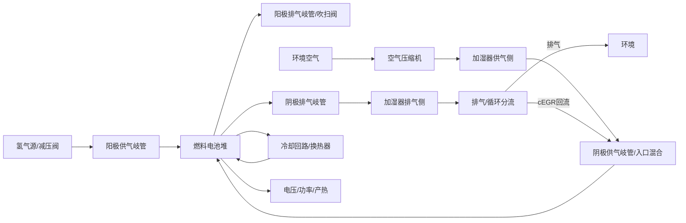

# 氢燃料电池系统模型：书籍建模标准整理

更新时间：2026-05-22

来源文件：`参考建模材料\书籍-氢燃料电池系统模型.pptx`

说明：该 PPT 是图片型书页摘录，内容来自《氢燃料电池多物理过程建模与仿真》第 6 章“燃料电池系统模型及仿真方法”中系统模型建模相关部分。本文档不是逐字摘录，而是把后续 cEGR 燃料电池系统 Simulink 建模需要反复读取的建模范式、物理连接、控制方程骨架和源项含义整理成工程参考。

## 0. 使用方式

后续在 `E:\agentwork_pemfc_cEGR_0519` 内建立或审查燃料电池系统模型时，先读本文件。正式模型至少要满足：

- 不是经验公式拼接；每个核心子系统必须有状态量、控制方程、源项表达式、参数物理意义和参数来源。
- 电堆必须能表征“电-气-水-热”耦合：电压极化、阴阳极气体组分、膜水/液水/水蒸气、产热与散热。
- BOP 辅件不能只做效率系数；空压机、阀/岐管、加湿器、换热器、氢循环/引射器等要有守恒方程、特性曲线或可追溯的代数关系。
- 临时占位可以用于结构打通，但必须在模型、结果和说明文件中明确标注“占位/待标定/待文献确认”，不能作为最终物理结论。

## 1. 物理场与模块连接关系

书籍采用模块化低维系统模型：每个部件像黑箱一样定义输入、输出和内部控制方程；全局系统通过压力、流量、温度、湿度、组分、电流和热量进行耦合。



对当前 cEGR 项目，阴极回路应在书籍“盲端阳极系统”基础上扩展为：空压机出口新鲜空气、加湿器干侧出口、阴极尾气回流气在电堆入口前混合；阴极出口经加湿器湿侧、水分离/冷凝和循环分流后，一部分排出，一部分回到电堆入口。

## 2. 电堆局部模块

### 2.1 电化学反应模块

目标：计算单片电压、电堆电压、电堆功率，并给流动扩散模块提供反应消耗和产水源项。

核心结构：

```text
P_fc = N_cell * V_cell * I_fc * A_cell
V_fc = N_cell * V_cell
V_cell = E_r - eta_act - eta_ohm - eta_con
```

可逆电压采用 Nernst 形式，必须随温度、阳极氢分压、阴极氧分压变化：

```text
E_r = E0 - (DeltaS / 2F) * (T_fc - T0)
      + (R*T_fc / 2F) * ln[(p_H2^a / p_ref) * (p_O2^c / p_ref)^0.5]
```

活化损失、欧姆损失和浓差损失分别代表反应动力学、电荷/质子传导和反应物传质限制：

```text
eta_act = (R*T_fc / (2*alpha_H2*F)) * ln((I_fc + I_leak)/I0_a)
        + (R*T_fc / (4*alpha_O2*F)) * ln((I_fc + I_leak)/I0_c)

eta_ohm = I_fc * delta_PEM / sigma_PEM + I_fc * ASR0

sigma_PEM = f(lambda, T_fc)

eta_con = f(I_fc, I_leak, I_lim, T_fc)
```

建模要求：

- `E_r` 必须由阴阳极分压和温度驱动，不能固定为常数。
- `eta_ohm` 与膜水含量 `lambda`、膜厚和膜电导率耦合。
- `eta_con` 必须能体现接近限流电流密度时的传质恶化。
- 电压模型输出应保留 `E_r / eta_act / eta_ohm / eta_con` 分项，便于标定和诊断。

### 2.2 阳极流动扩散模块

目标：计算阳极氢分压、阳极进出口流量、阳极水蒸气/液态水/氮气状态，并向电化学模块提供 `p_H2^a`。

阳极通道氢分压按理想气体关系：

```text
p_H2^a = R*T_fc*m_H2^a / (M_H2 * V_CH^a)
```

阳极通道质量守恒状态方程骨架：

```text
d(m_H2^a)/dt = m_in,cell^a - m_H2,GDL^a - m_out,cell^a * Y_H2^a
d(m_v^a)/dt  = -m_v,GDL^a - m_out,cell^a * Y_v^a + S_phase^a
d(m_l^a)/dt  = -m_l,GDL^a - m_l,out^a - S_phase^a
d(m_N2^a)/dt = m_N2,cross - m_out,cell^a * Y_N2^a
```

阳极进出口流量采用岐管和通道之间的压差关系：

```text
m_in,cell^a  = k_in^a  * (p_SM^a - sum(p_i^a))
m_out,cell^a = k_out^a * (sum(p_i^a) - p_EM^a)
m_in^a       = N_cell * m_in,cell^a
m_out^a      = N_cell * m_out,cell^a
```

主要源项含义：

- `m_H2,GDL^a`：氢气穿过阳极 GDL 到达催化层并被反应消耗，按 Faraday 定律与电流成正比。
- `m_v,GDL^a`：水蒸气通过 GDL 的扩散通量，由水蒸气浓度梯度驱动。
- `m_l,GDL^a`：液态水通过 GDL 的毛细压力/Darcy 流动通量。
- `S_phase^a`：阳极通道内水蒸气和液态水相变源项，由 `p_v^a` 与饱和蒸气压 `p_sat(T_fc)` 的差值决定；蒸发为水蒸气正源项，冷凝为水蒸气负源项。
- `m_N2,cross`：阴极氮气通过膜交叉渗透到阳极的源项。

阳极 GDL 水状态还应跟踪：

```text
C_a = p_v,GDL^a / (R*T_fc)
s_a = m_l,GDL^a / (rho_l * epsilon_GDL * V_GDL^a)
```

其中 `C_a` 表示 GDL 内水蒸气浓度，`s_a` 表示相对液态水饱和度。

### 2.3 阴极流动扩散模块

目标：计算阴极氧分压、阴极进出口流量、阴极水蒸气/液态水/氮气状态，并向电化学模块提供 `p_O2^c`。

阴极氧分压：

```text
p_O2^c = R*T_fc*m_O2^c / (M_O2 * V_CH^c)
```

阴极通道质量守恒状态方程骨架：

```text
d(m_O2^c)/dt = (0.233/(1 + omega_in)) * m_in,cell^c
               - m_O2,GDL^c - m_out,cell^c * Y_O2^c

d(m_v^c)/dt  = (omega_in/(1 + omega_in)) * m_in,cell^c
               - m_v,GDL^c - m_out,cell^c * Y_v^c + S_phase^c

d(m_l^c)/dt  = -m_l,GDL^c - m_l,out^c - S_phase^c

d(m_N2^c)/dt = ((1 - 0.233)/(1 + omega_in)) * m_in,cell^c
               - m_N2,cross - m_out,cell^c * Y_N2^c
```

阴极进出口流量：

```text
m_in,cell^c  = k_in^c  * (p_SM^c - sum(p_i^c))
m_out,cell^c = k_out^c * (sum(p_i^c) - p_EM^c)
m_in^c       = N_cell * m_in,cell^c
m_out^c      = N_cell * m_out,cell^c
```

主要源项含义：

- `m_O2,GDL^c`：氧气穿过阴极 GDL 到达催化层并被反应消耗，按 Faraday 定律与电流成正比。
- `m_v,GDL^c`：阴极 GDL 内水蒸气扩散通量。
- `m_l,GDL^c`：阴极 GDL 内液态水毛细流动通量。
- `S_phase^c`：阴极通道内水蒸气/液态水相变源项。
- `m_N2,cross`：阴极氮气向阳极交叉渗透，阴极为损失项。
- 阴极反应生成水应进入阴极 GDL/膜界面水源项，不能简单只加到出口湿度。

阴极 GDL 水状态：

```text
C_c = p_v,GDL^c / (R*T_fc)
s_c = m_l,GDL^c / (rho_l * epsilon_GDL * V_GDL^c)
```

### 2.4 膜传输模块

目标：计算膜水含量 `lambda`、跨膜水通量、膜与阳极/阴极 GDL 界面的水转化量，以及氮气交叉渗透。

膜水含量可以采用两类方式：

1. 准静态模型：`lambda` 由阴阳极两侧等效膜水含量平均得到。
2. 动态模型：`lambda` 由膜态水质量守恒 ODE 得到。

准静态膜水含量骨架：

```text
lambda = (lambda_eq^a + lambda_eq^c) / 2
a_j = p_v,GDL^j / p_sat(T_fc)     j = a,c

lambda_eq^j =
  polynomial(a_j),                 0 < a_j <= 1
  linear_extension(a_j),            1 < a_j <= 3
```

跨膜水通量由电渗拖拽和反扩散共同决定：

```text
J_H2O,PEM = n_d * I_fc / F
            - D_PEM * (C_v^c - C_v^a) / delta_PEM
```

其中：

- 第一项是质子迁移带来的电渗拖拽。
- 第二项是阳极/阴极水浓度差引起的反扩散。
- `n_d = f(lambda)`，`D_PEM = f(lambda, T_fc)`，书中给出分段经验表达式。

动态膜水含量骨架：

```text
d(lambda)/dt = - EW / (delta_PEM * rho_PEM * M_H2O * A_cell)
               * [(m_v,PEM^a + m_l,PEM^a) + (m_v,PEM^c + m_l,PEM^c)]
```

膜-GDL 界面的水转化源项应由吸附/脱附关系决定。实现时要保留：

- `m_v,PEM^a`、`m_l,PEM^a`：阳极膜-GDL 界面膜态水与水蒸气/液态水转化量。
- `m_v,PEM^c`、`m_l,PEM^c`：阴极膜-GDL 界面膜态水与水蒸气/液态水转化量。
- `lambda` 与 `lambda_eq` 的偏差决定吸附/脱附方向。

建模要求：

- 膜水含量必须反馈到膜电导率和欧姆损失。
- 跨膜水迁移必须同时影响阳极、阴极水蒸气/液态水状态。
- 如果先做简化稳态模型，至少要保留 `lambda`、跨膜水通量、阴阳极湿度的显式关系。

### 2.5 电堆热模型

目标：用能量守恒计算电堆温度或热量平衡，连接反应放热、电功输出、冷却、环境散热和气体显热。

电堆温度控制方程骨架：

```text
C_fc * dT_fc/dt =
    N_cell * I_fc * A_cell / (2F) * LHV
    - P_fc
    - Phi_cool
    - Phi_loss
    - Phi_g
```

各项含义：

- `LHV` 项：氢气低热值对应的化学能输入。
- `P_fc`：输出电功率。
- `Phi_cool`：冷却水带走的热量。
- `Phi_loss`：电堆与环境的自然对流/辐射散热。
- `Phi_g`：进气被加热到电堆温度所吸收的显热。

冷却换热可选两种骨架：

```text
Phi_cool = h_cool * A_cool * (T_fc - T_cool,in)

Phi_cool = epsilon * (m_dot_cool * c_p,cool) * (T_fc - T_cool,in)
epsilon = 1 - exp(-NTU)
```

环境散热：

```text
Phi_loss = h_nc * A_sur * (T_fc - T_amb)
           + epsilon_h * sigma * A_sur * (T_fc^4 - T_amb^4)
```

气体显热：

```text
Phi_g = m_in^a * c_p,a * (T_fc - T_in^a)
        + m_in^c * c_p,c * (T_fc - T_in^c)
```

建模要求：

- 正式热模型不能只用固定热效率，应能解释热源、冷却带热、气体焓变和相变热的量级。
- 若暂不建完整冷却回路，应明确“恒温边界”或“冷却充分假设”，不能把温度动态结论外推。

## 3. BOP 辅件模型

### 3.1 岐管/管路容积

岐管代表部件连接区，可按集中容积处理。压力动态来自质量守恒和理想气体状态方程：

```text
dp_m/dt = R*T_m/(V_m*M_m) * (m_in,m - m_out,m)
```

管口/阀口流量可采用可压缩节流模型：

```text
m_dot = f(C_D, A_T, p_up, p_dw, T_up, M_m, gamma)
```

当上下游压比较大时采用临界/阻塞流表达式；压差很小时可用线性化：

```text
m_dot = k_f * (p_up - p_dw)
```

建模要求：

- 供气岐管和排气岐管应输出压力给电堆通道。
- 电堆通道进出口流量应反过来作为岐管质量流量边界。
- 阀、吹扫阀、电子节气门、减压阀等都可以归入节流模型，但要保留开度、面积或流量系数来源。

### 3.2 空气压缩机

空压机模型需要同时表示流量-压力-转速关系、工作边界和转速动态。

MAP 拟合骨架：

```text
x = normalized(speed)
y = normalized(pressure_ratio)
m_dot_cp,rd = polynomial_2D(x, y)
```

工作边界：

```text
p_surge,rd = polynomial(m_dot_cp,rd)
p_max,rd   = polynomial(m_dot_cp,rd)

p_max,rd <= p_cp,rd <= p_surge,rd
```

标准工况修正：

```text
p_cp = p_cp,rd * p_rd / p_amb
r_cp = r_cp,rd * sqrt(p_rd / p_amb)
m_dot_cp = corrected_flow(m_dot_cp,rd, p_amb, T_amb)
```

转速动态：

```text
r_cp = 30*omega_cp/pi
J_cp * d(omega_cp)/dt = tau_cm - tau_cp
```

驱动电机转矩与压缩机负载转矩：

```text
tau_cm = f(motor_voltage, motor_speed, motor_params)
tau_cp = P_cp / omega_cp
P_cp   = function(m_dot_cp, pressure_ratio, T_in, eta_cp)
```

建模要求：

- 有供应商 MAP 时优先使用 MAP 或查表；没有时只能作为临时估算。
- 必须检查喘振线、最大流量线和转速边界。
- 空压机出口温度要进入加湿器/中冷器/电堆入口热湿状态。

### 3.3 引射器/氢循环装置

书中引射器按泵吸区、混合区、扩散区分段，用可压缩流动关系计算局部压力、温度、马赫数和出口状态。

建模骨架：

```text
primary_stream + secondary_stream
  -> suction_section
  -> mixing_section
  -> diffuser_section
  -> outlet_pressure, outlet_temperature, outlet_flow
```

需要保留的物理关系：

- 一次流与二次流的质量、动量和能量关系。
- 临界/亚临界流判断。
- 混合区等焓或能量守恒假设。
- 扩散区压升和效率。

当前 cEGR 项目的阴极循环如果采用自吸/引射结构，应参照该形式建立“新鲜空气驱动 + 阴极尾气二次流”的混合与压损模型，而不是只给固定循环比。

### 3.4 电化学氢泵

电化学氢泵用于氢循环时，驱动电压由可逆电压、活化损失和欧姆损失组成：

```text
V_EHP = N_EHP * (E_r,EHP + eta_act,EHP + eta_ohm,EHP)
E_r,EHP = (R*T_EHP/(2F)) * ln(p_c/p_a)
eta_act,EHP = (R*T_EHP/(2*alpha_H2*F)) * ln(I_EHP/I0,H2)
eta_ohm,EHP = R_EHP * I_EHP * A_EHP
```

氢泵电流密度由可输送氢气流量决定：

```text
I_EHP = 2F*m_dot_s / (N_EHP * A_EHP * M_H2)
P_EHP = V_EHP * I_EHP * A_EHP
```

### 3.5 膜加湿器

加湿器要同时考虑供气侧与排气侧的水传输和热传递。书中假设气体为理想气体、加湿器与环境绝热，热量主要在膜两侧传递。

供气侧/排气侧质量守恒骨架：

```text
d(m_i)/dt = m_i,in + m_i,tr - m_i,out
          = m_i,in/(1 + omega_i,in) * (omega_i,in - omega_i,out)
```

能量守恒骨架：

```text
enthalpy_out = heat_transfer
               + enthalpy_in
               + water_transfer_enthalpy
               - internal_energy_storage
```

跨膜水传输：

```text
m_dot_tr = D_mem * (C_e - C_s) / delta_mem * M_H2O * A_hum
```

跨膜换热：

```text
Phi_hum = h_hum * A_hum * DeltaT_m
DeltaT_m = log_mean_temperature_difference
```

建模要求：

- 加湿器不能只用固定出口 RH；至少要保留干侧、湿侧入口状态、跨膜水传输、换热和出口含湿量关系。
- 对 cEGR，湿侧水来自阴极尾气；水的去向包括跨膜到供气侧、冷凝/分水、随排气排出、随循环气回流。

### 3.6 换热器/中冷器/冷却回路

换热器气侧温度动态：

```text
rho_g * V_ex,g * c_g * dT_ex,g/dt =
    m_dot_g * c_g * (T_ex,g,in - T_ex,g,out) + Phi_ex
```

换热量可用效率-传热单元法：

```text
Phi_ex = epsilon * (m_dot*c_p)_min * (T_hot,in - T_cold,in)
NTU = KA / (m_dot*c_p)_min
C_star = (m_dot*c_p)_min / (m_dot*c_p)_max
epsilon = f(NTU, C_star, flow_arrangement)
```

总传热能力：

```text
1/KA = gas_side_resistance + wall_conduction_resistance + coolant_side_resistance
```

建模要求：

- 空压机出口若经中冷器，必须把气体温度、相对湿度、冷凝风险传递到加湿器/电堆入口。
- 冷却回路若作为恒温边界，必须明确假设；若研究热动态，必须建立冷却液流量、热容、换热器和控制逻辑。

## 4. 对当前 cEGR 模型的执行标准

### 4.1 每个子系统必须写清楚的内容

每新增或升级一个模块，都要在模型说明或代码注释中明确：

| 项目 | 要求 |
|---|---|
| 状态量 | 例如压力、气体组分质量、水蒸气质量、液态水质量、膜水含量、温度、转速 |
| 控制方程 | ODE 或代数方程，说明守恒关系或物理定律 |
| 源项 | 反应消耗、产水、相变、跨膜迁移、扩散、交叉渗透、压缩功、换热等 |
| 参数 | 单位、物理意义、默认值、来源、适用范围 |
| 输入输出 | 与上下游模块传递的压力、流量、温湿度、组分、热量、功率 |
| 验证 | 台架数据、供应商数据、MathWorks 示例、文献或量级核算 |

### 4.2 允许的实现路径

- 优先：MathWorks PEMFC/Simscape 参考模型或成熟物理模块。
- 可接受：自编 MATLAB Function / Simulink 子系统 / Simscape 自定义组件，但方程必须有书籍、文献或数据支撑。
- 临时：低阶占位模型，只用于跑通接口和做结构检查；不得作为最终结论。

### 4.3 需要避免的做法

- 只用一条经验极化曲线代表所有氧浓度、湿度和温度条件。
- 只用固定循环比表示 cEGR，而不计算混合、压损、湿度、氧浓度和水热状态。
- 只用固定加湿效率表示膜加湿器，而不考虑湿侧水来源和跨膜传输。
- 只用固定压比/效率表示空压机，而不考虑 MAP、喘振和最大流量边界。
- 只用固定温度表示电堆，而不说明冷却充分或恒温假设。
- 把没有来源的经验系数写成正式物理模型参数。

## 5. 后续建模优先级

1. 把现有电堆电压模型继续保留为 `E_r - eta_act - eta_ohm - eta_con` 分项结构，并补膜水对欧姆项的影响。
2. 建立阴极通道和阴极 GDL 的 `O2/N2/H2O_v/H2O_l` 质量守恒，明确 cEGR 回流对入口组分和湿度的影响。
3. 补阳极通道质量守恒，至少包含氢耗、水迁移和氮气交叉渗透的接口。
4. 建立膜水模块，使 `lambda` 同时影响膜电阻和跨膜水迁移。
5. 用守恒方程或设备特性替换空压机、加湿器、阀/岐管、水分离/冷凝等占位模型。
6. 若研究热管理，补充冷却回路和换热器；若暂不研究，明确恒温电堆假设。
7. 所有模型结果文件必须写明模型版本、数据来源、占位项和不能外推的边界。

